## Chapter 7: Statistical Inference

Class: Soc 303

Author: Sherri Verdugo, CSUF Instructor

Date: 9/29/2014

--- .class #title 

## Administration Topics

* Attendance
* Always read instructions for assignments:
    * either in the forum, the initial posting, or the document itself
* This Week: 
    * Chapter 7 Statistical Inference
    * Chapter 8 Probability, z and t tests
* Upcoming Items
    * Homework 1 is due by -- Midnight 9/30/14. Late fee kicks in after midnight.
    * Homework 2 released next Monday 10/6/14
    * Exam 2 10/22
    * Writing Draft 10/29

--- .class #admin

## Chapter 7 Statistical Inference and Tests of Inference

### Prologue

In social sciences, biology, or any field...we have a slight problem with the need to generalize about groups. Sometimes, the groups are too large and we can't find everyone, it could be cost prohibitive in both terms of time and money, etc. So, how can we study a smaller representation of a larger group that we may not be able to study in it's entirety. To accomplish this fundamental aspect of research....we can take a representative and random sample from a population. We then can use probability theory to make a decision about the hypothesis that we wish to test.

Now when we talk about statistics, we can keep this in mind:

* A **P**arameter is to a **P**opulation as a **S**tatistic is to a **S**ample

--- .class #pro

## Chapter Outline

* What is Statistical Inference?
* Sampling
* Random Samples
* Normal Curve (Outside Textbook Information)
* Hypotheses
* Comparing Means
  * One Sample
  * Two Sample
  * Multiple Samples
* Test Statistic
* Significance and Confidence
* Probabilities
* Decision Making
* Types of Errors
* Review: Equations and Key Concepts 

--- .class #outline

## Statistical Inference

Statistical inference is achieved by using tests of statistical significance, or techniques that help us to generalize to a larger group.

A **P**arameter is to a **P**opulation as a **S**tatistic is to a **S**ample

* Sample: group of subjects in a study
* Population: All possible subjects that we intend to learn about
* Probabilities are theoretical...
    * They are expectations of what will happen
* Actual trials are empirical
    * They are actually what does happen 
* Equally Likely Model – all outcomes are equally likely of occurring 
* Mutually Exclusive Outcomes – outcome of one trial is independent of the outcome on any other trial
* Mutually Exhaustive Outcomes - we account for all possible outcomes in a scenario. 

---  .class #inf1

## Statistical Inference.... Not a problem.

Eleanor scores 680 on the Mathematics part of the SAT. The distribution of SAT scores in a reference population is Normal, with mean 500 and standard deviation 100. Gerald takes the American College Testing (ACT) Mathematics test and scores 27. ACT scores are Normally distributed with mean 18 and standard deviation 6. Assuming that both tests measure the same kind of ability, who did better?

1. _Eleanor_
2. Gerald

#### Explanation

We need to standardize the scores to make the comparison for the informed decision.

* Eleanor $$z_E = \frac{680 - 500}{100} = 1.8$$
* Gerald $$z_G = \frac{27 - 18}{6} = 1.5$$

Since, Eleanor has a higher standardized score, we can conclude that Eleanor did better!

* Source: http://ramnathv.github.io/user2014-idocs-slides/demos/widgets/quiz-all/#3

---  .class #inf2

## Statistical Inference ... a few more words.

Consider this type of question:

Linda is 31 years old, single, outspoken, and very bright. She majored in philosophy. As a student, she was deeply concerned with issues of discrimination and social justice, and also participated in anti-nuclear demonstrations.

Which is more probable?

1. _Linda is a bank teller._
2. Linda is a bank teller and is active in the feminist movement.

#### Hint

Think about the probabilities of each event, and that of both of them together.

#### Explanation

If you selected 2, step back and think. Suppose we denote the event of Linda being a teller by A and the event she is active in the feminist movement by B, then probabilities in question can be written as.

- P(A)
- $P(A \cap B)$

This is called the [conjugacy fallacy](http://en.wikipedia.org/wiki/Conjunction_fallacy) that occurs when it is assumed that specific conditions are more probable than a single general one.

--- .class #inf3

## Sampling

Examples:

* A pollster is sure that the responses to his “agree/disagree” question will follow a binomial distribution, but p, the proportion of those who “agree” in the population, is unknown.
* An agronomist believes that the yield per acre of a variety of wheat is approximately normally distributed, but the mean m and the standard deviation s of the yields are unknown.
* If you want the sample to provide reliable information about the population, you must select your sample in a certain way!

--- .class #sampling

## Sampling

* Sampling Error – differences between two samples that are attributed to random error or chance 

* Significant Differences – differences between two samples that are attributed to an outside factor such as an IV 

### Brief Intro to the Central Limit Theorem and Sampling

* Next week we will cover this in more detail, but for now:

* Central Limit Theorem – the means of an infinite number of samples drawn from the same population will approximate a normal distribution 

* The mean of this distribution, called the sampling distribution of the mean, is equal to the mean of the population 

--- .class #sampling2

## Sampling Distribution

Definition: The **sampling distribution** of a statistic is the probability distribution for the possible values of the statistic that results when random samples of size n are repeatedly drawn from the population.

* Population: 3, 5, 2, 1
    * Draw samples of size n = 3 without replacement

* Possible Samples:

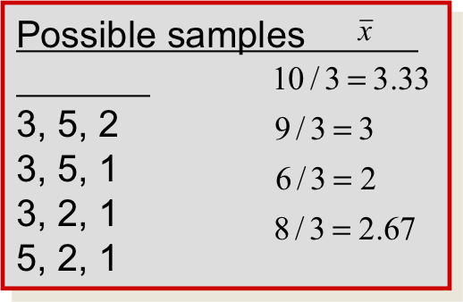 
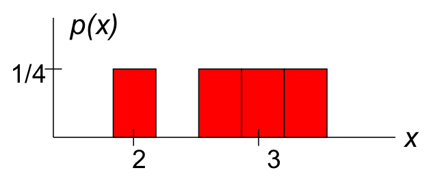

Each value of x-bar is equally likely, with probability 1/4

--- .class #sampling3

##  Random Samples

* The sampling plan or experimental design determines the amount of information you can extract, and often allows you to measure the reliability of your inference.
* Simple random sampling is a method of sampling that allows each possible sample of size n an equal probability of being selected.

### Types of Random Samples

Sampling can occur in two types of practical situations:

* Observational studies: The data existed before you decided to study it. Watch out for
    * Nonresponse: Are the responses biased because only opinionated people responded?
    *Undercoverage: Are certain segments of the population systematically excluded?
    * Wording bias: The question may be too complicated or poorly worded.
* Experimentation: The data are generated by imposing an experimental condition or treatment on the experimental units. 
    *Hypothetical populations can make random sampling difficult if not impossible.
    * Samples must sometimes be chosen so that the experimenter believes they are representative of the whole population. 
    * Samples must behave like random samples!

### Examples 

* Stratified random sample:  Divide the population into sub populations or strata and select a simple random sample from each strata.
* Cluster sample: Divide the population into subgroups called clusters; select a simple random sample of clusters and take a census of every element in the cluster.
* 1-in-k systematic sample: Randomly select one of the first k elements in an ordered population, and then select every k-th element thereafter.

--- .class #random

## More Examples

* Divide California into counties and take a simple random sample within each county.
    * Stratified
* Divide California into counties and take a simple random sample of 10 counties.
    * Clustered
Divide a city into city blocks, choose a simple random sample of 10 city blocks, and interview all who live there.
    * Clustered
Choose an entry at random from the phone book, and select every 50th number thereafter. 
    * 1 in 50 Systematic

--- .class #random2

## Non-Random Sampling Plans: Not used for statistical inference

* Can be used for data mining

* Convenience sample:  A sample that can be taken easily without random selection.
    * People walking by on the street
* Judgment sample: The sampler decides who will and won’t be included in the sample.  	
* Quota sample: The makeup of the sample must reflect the makeup of the population on some selected characteristic.
    * Race, ethnic origin, gender, etc.

--- .class #nonrandom

## Normal Curve (Outside Textbook Information)

### ...The Bell Shaped Curve...

The normal curve is symmetric, bell shaped, and asymptotic. The inflection points fall at one standard deviation above and below the mean.

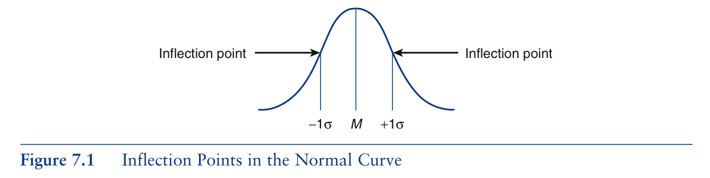

--- .class #normal1

## Normal Curve: Areas Under the Curve

The normal curve always has these proportions:

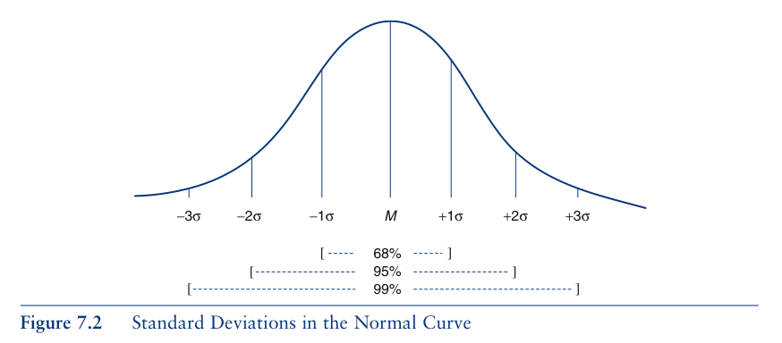

and 

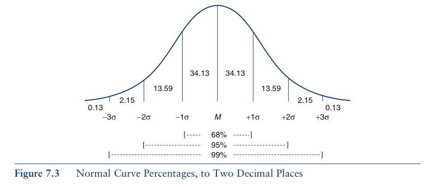

--- .class #normal2

## Hypotheses

Hypothesis tests follow a logical format ...

* (𝑊ℎ𝑎𝑡 𝑑𝑖𝑑 𝑦𝑜𝑢 𝑔𝑒𝑡?−𝑊ℎ𝑎𝑡 𝑑𝑖𝑑 𝑦𝑜𝑢 𝑒𝑥𝑝𝑒𝑐𝑡?)/(𝑆𝑡𝑎𝑛𝑑𝑎𝑟𝑑𝑖𝑧𝑒𝑑 𝑅𝑎𝑛𝑑𝑜𝑚 𝐸𝑟𝑟𝑜𝑟 )

Z-scores have the same formula with X = what you got, M = what you expected, and s = the standardized random error 

* Independent Variable (IV) – the causal variable
    * Is typically manipulated by the researcher

* Dependent Variable (DV) – the effect 
    * Is typically expected to be impacted by the IV 

* Extraneous Variable (XV) or Confounding Variable (CV) – unintended variable               
    * Impacts the DV 

* Hypotheses:
    * Null Hypothesis – no effect of IV on DV $\mu_x = \mu_y$
    * Research (Alternative) Hypothesis (H1 or HA $\mu_x ≠ \mu_y$ or $\mu_x < \mu_y$) – what is expected to be found 
* Types of Hypotheses:  
    * Directional – the IV is expected to ONLY increase or ONLY decrease the DV
      $\mu_x > \mu_y$ or $\mu_x < \mu_y$ 
    * Nondirectional – effect of IV could increas $\mu_x ≠ \mu_y$ or decrease the DV 

--- .class #hyp1

## Comparing Means
  * One Sample z test 
  $z = \frac{\bar{x}-\mu}{\frac{\sigma}{\sqrt{n}}}$ 

### Work through Example Pg. 209

### Upcoming Items

  * Two Sample z test (next chapter)
  * Multiple Samples (future chapters)

--- .class #means1

## Test Statistic: z score 

Obtain the value for the test statistic that was calculated... Page 561
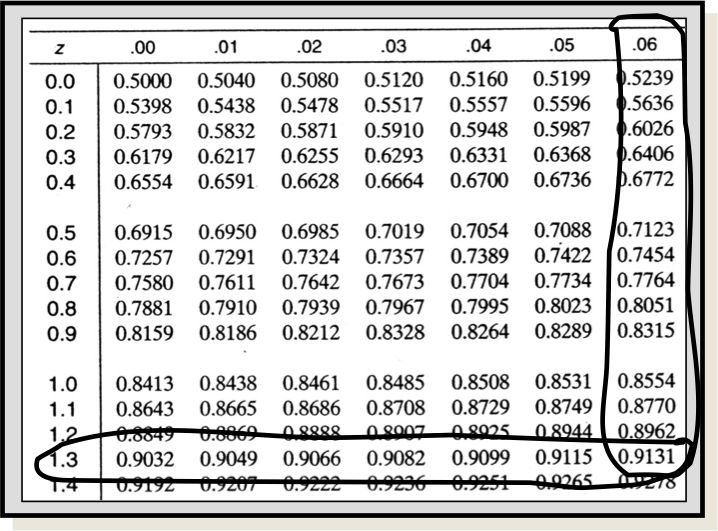

It actually looks like this:
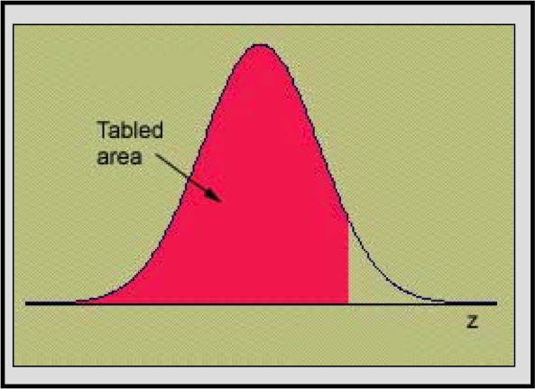

For this value it would:

Z-scores can be used to determine proportions of the curve 

--- .class #teststat

## Probabilities, Significance and Confidence

For Critical Values of Z

Prob. significance level | 1-tailed (directional) | 2-Tailed (non-directional)
-------------------------|------------------------|---------------------------
0.05                     | 1.65                   | 1.96
0.01                     | 2.33                   | 2.58
0.001                    | 3.09                   | 3.29

**Example: Pg. 212**
 
$z_{obtained}=\frac{51.70-50}{\frac{10}{\sqrt{100}}}$
$= \frac{1.70}{\frac{10}{10}} = \frac{1.70}{1} = 1.70$

Depending on the direction or non-direction of your result, you can make the following conclusions if:

* $z_{obt} > z_{crit}$ Reject the $H_0$ in favor of the $H_1$

and 

* $z_{obt} < z_{crit}$ Retain the $H_0$ in favor of the $H_1$

--- .class #ztest

## Decision Making

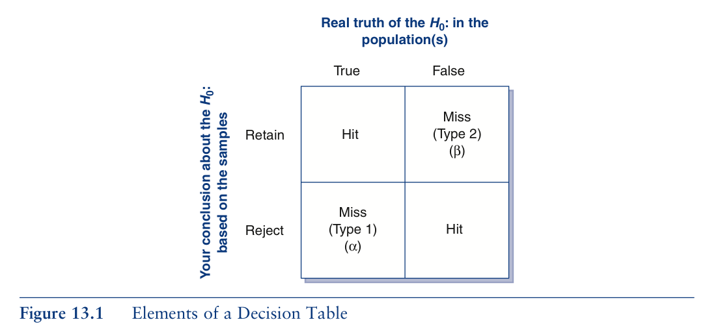

--- .class #decision1

## Types of Errors

### Graphically

* When the null is retained we expect the following to be the case

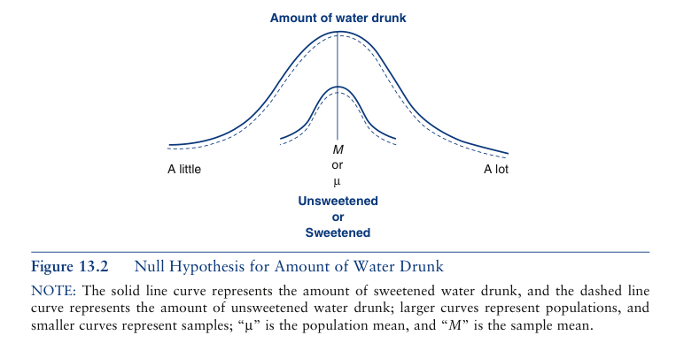

* When the null is rejected we expect the following to be the case

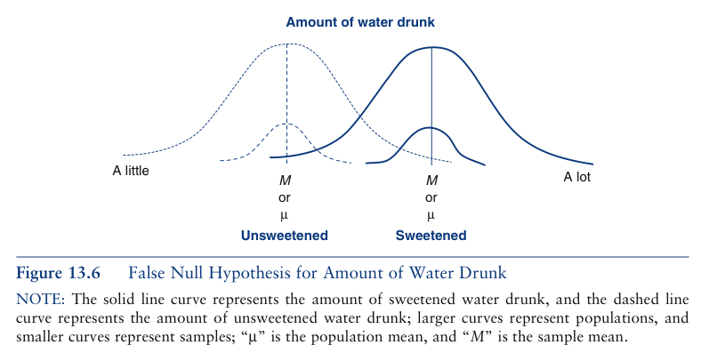

--- .class #errors

## Types of Errors

### Type I: $\alpha$ Error

1. The probability of falsely rejeting a true null hypothesis.
2. A type 1 error occurs when two samples appear to be different, but are actually from the same population. 

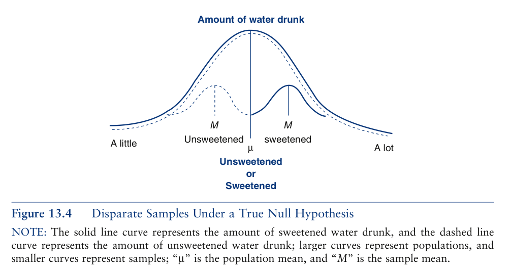

### Type II: $\beta $ Error

1. Failure to reject a false null hypothesis.
2. Type 2 errors occur when two samples appear to be from the same population, but are actually from different populations.

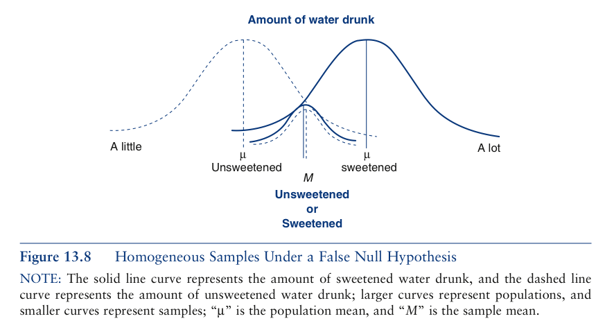

--- .class #error2

## Equations: Population Parameters

Equations calculated **FOR POPULATION MEASURES** only.

* The Mean: $\mu =\frac{\Sigma x}{N}$
* Variance (computational): $\sigma ^2 = \frac{\Sigma(x - \mu)^2}{N}$
* Variance (definitional): $\sigma^2 = \frac{\Sigma x^2 - \frac{(\Sigma x)^2}{N}}{N}$
* Standard Deviation: $\sqrt{\sigma^2} = \sigma$

--- .class #eq1

## Equations: Sample Statistics

Equations calculated for **SAMPLE MEASURES** only

* The Mean: $\bar{x} = \frac{\Sigma x}{n}$
* Variance (computational): $s^2 = \frac{\Sigma (x - \bar{x})^2}{n}$
* Variance (definitional): $s^2 = \frac{\Sigma x^2 - \frac{(\Sigma x)^2}{n}}{n}$
* Standard Deviation: $\sqrt{s^2} = s$

--- .class #eq2

### New Equation: z Test of Statistical Significance

The z test equation is:  $z = \frac{\bar{x}-\mu}{\frac{\sigma}{\sqrt{n}}}$

--- .class #eq3

## Key Concepts

* Tests of Statistical Significance
    * Techniques that help us to generalize to a larger group.
* Inferential Statistics (Inductive Statistics)
    * The body of knowledge that deals with tests of significance.
* Descriptive Statistics
    * Statistics in which frequency distributions or relationships between variables are described.
* Population/Sampling Universe
    * The group about which we want to generalize.
* Sample
    * The smaller group from the population that is selected to be studied.
* Drawing a Sample
    * The selection of subjects to be in a sample.
* Sampling Bias/Biased Sample
    * The mechanism for selecting the sample that causes the sample to be not representative of the population as a whole.

--- .class #definitions1

## Key Concepts

* Random Sample
    * A sample that is not biased.
* Simple Random Sample
    * A sample drawn in such a way that every member of the population has an equal likelihood of being included in the sample.
* Sampling Error
    * A deviation from what actually exists in the population not associated with sampling bias but still existing, even though the sample was randomly drawn.
* Normal Curve
    * The normal curve is symmetric, bell shaped, and asymptotic. The inflection points fall at one standard deviation above and below the mean.
* Hypotheses
    * Null Hypothesis ($H_0$): A statement postulating that in the population, the means of two or more groups are the same or, in the case of two variables in a cross-tabulation, that in the population, the two variables are unrelated.    
    * Alternative/Research Hypothesis ($H_1$): Statement that indicates that in the population, the means of two or more groups differ or, in the case of a cross-tabulation, the two variables are related.
* Fallacy of Affirming the Consequent
    * A principle of logic that suggests that the only way to "prove" the alternative or research hypothesis is to demonstrate that the null hypothesis is true.
    

--- .class #definitions2

## Key Concepts

* Chi-Square Test
    * A test of significance for two variables in a cross-tabulation.
* Sample Statistics
    * Information computed from sample data.
* Population Parameters
    * Information computed from population data.
* Population mean, mu, and $\mu$
    * Population Mean: $\mu$ is the population's mean
* Population Standard Deviation / lower case sigma $\sigma$
    * Population St. Deviation: $\sigma^2$ is the population's standard deviation
* N:
    * Population size.

--- .class #definitions3

## Key Concepts

* One Sample Tests
    * Tests that compare data from a sample to similar data in a population.
* One Sample z test.
    * A test of significance that can be performed when we know the population's standard deviation as well as it's mean.
* One Sample t test
    * A test that can be performed when we know the population's mean but not it's standard deviation.
* Two Sample t test
    A t test that compares two sample means, rather than one sample's mean to another population's mean.
* One Way Analysis of Variance (ANOVA)
    * A test in which two or more sample means may be compared simultaneously.
* .05 Level of Significance
    * The probability level classically used by social statisticians for determining that a null hypothesis may be rejected.
* Probabilities
    * Proportions that reflect the likelihood of a particular outcome.

--- .class #definitions4

## Key Concepts

* Type I Error / Alpha ($\alpha$) Error
    * The probability of falsely rejecting a true null hypothesis.
* Non-directional Hypothesis / Two-tailed Alternative Hypothesis / Two-tailed Test
    * An alternative hypothesis that does not specify the directionality (i.e. which mean will ultimately be larger).
* Directional Hypothesis / One-tailed Alternative Hypothesis / One-tailed Test
    * An alternative hypothesis that does specify which mean will be the larger one.
* Degrees of Freedom:
    * An additional piece of information needed for tests where critical values vary with the problem and may be functions of such things as sample size.
* Type II Error/ Beta ($\beta$) Error
    * Failure to reject a false null hypothesis.

--- .class #nexttime

## Next Time

* Wednesday: Chapter 8 Probability, z and t tests
* IMPORTANT DEADLINES:
    * Homework 1 is due by -- Midnight 9/30/14. Late fee kicks in after midnight.
* Upcoming Items:
    * Homework 2 released next Monday 10/6/14
    * Exam 2 10/22
    * Writing Draft 10/29
